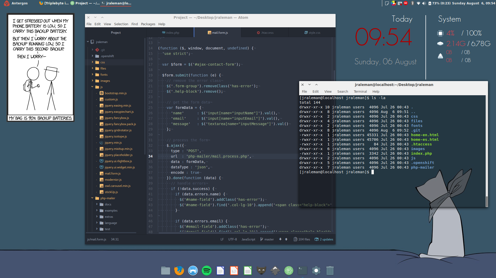

# Dot Files

Setting up a new system is very easy if you already have all your configurations
in files. Hence, the idea of dot files. With this way, we can do an installation
script, and install all your preferences within minutes.

Everyone is doing it, so...
[why not?](https://github.com/search?utf8=%E2%9C%93&q=dot+files&type=)

## Introduction

The “dotfiles” name is derived from the configuration files in Unix-like systems
that start with a dot like .bashrc, .gitconfig, etc...
For casuals, this indicates these are not regular documents, and by default,
these are hidden in directory listings.
But for the masterrace, however, they are a core tool belt.

## Goal of this repository

This repository exists because:

* It has all my configurations and preferences organized.
* There's a version control of the files.
* We can automate all the things!
* I can get a system running the way you want, in a very short time.
* Sharing is caring; people can use my files if they want. :D

## Screenshots

### Antergos Linux (Arch Linux based)

### Mac OS X (El Capitan)

## Disclaimer

You may use my files, as this collection is under a creative commons license.
But be careful with using them, I'm not responsible for what it can do to your
setup... always read the files so you know what's supposed to do.

## Shoutouts

Guys, your dotfiles are awesome. Keep up the good work! :D

* [nicksp](https://github.com/nicksp/dotfiles)
* [pbondoer](https://github.com/pbondoer/dotfiles)
